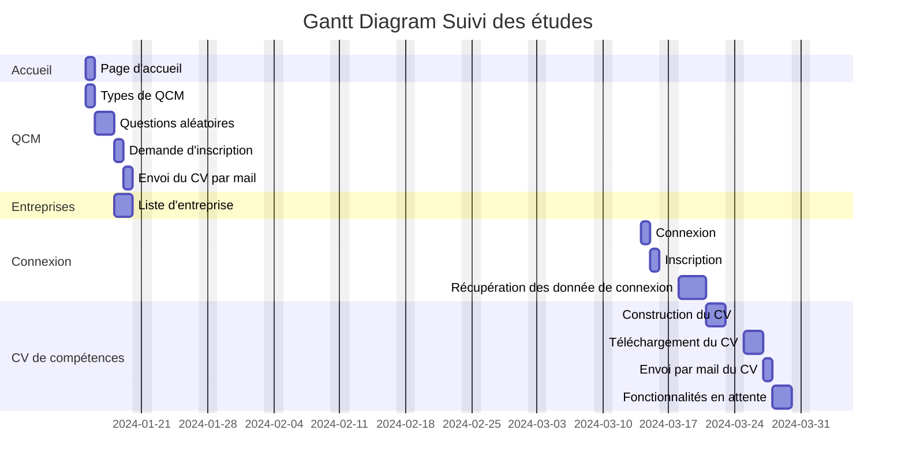

# Diagramme de Gantt
Le diagramme de Gantt, couramment utilisé en gestion de projet, est l'un des outils les plus efficaces pour représenter visuellement l'état d'avancement des différentes activités (tâches) qui constituent un projet. La colonne de gauche du diagramme énumère toutes les tâches à effectuer, tandis que la ligne d'en-tête représente les unités de temps les plus adaptées au projet (jours, semaines, mois etc.). Chaque tâche est matérialisée par une barre horizontale, dont la position et la longueur représentent la date de début, la durée et la date de fin. Ce diagramme permet donc de visualiser d'un seul coup d'œil :

Les différentes tâches à envisager
_ La date de début et la date de fin de chaque tâche
_ La durée escomptée de chaque tâche
_ Le chevauchement éventuel des tâches, et la durée de ce chevauchement
_ La date de début et la date de fin du projet dans son ensemble

En résumé, un diagramme de Gantt répertorie toutes les tâches à accomplir pour mener le projet à bien, et indique la date à laquelle ces tâches doivent être effectuées (le planning).

## Diagramme de Gantt : Suivi des études

Fonctionnalités :

_ Sauvegarder en base de donnée les informations de connexion

_ Sauvegarder en base de donnée les questions du QCM

_ Afficher les coupes pour chaque QCM et chaque CV à télécharger

_ Construire un CV personalisé à partir des informations de connexion

_ Détecter si un utilisateur est connecté à la fin d'un QCM

_ Afficher si un utilisateur est connecté

_ Télécharger un CV

_ Envoyer un CV par mail

