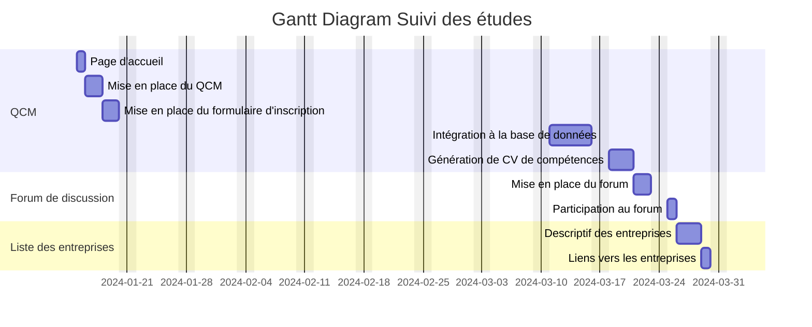
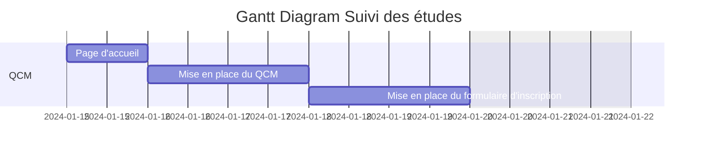
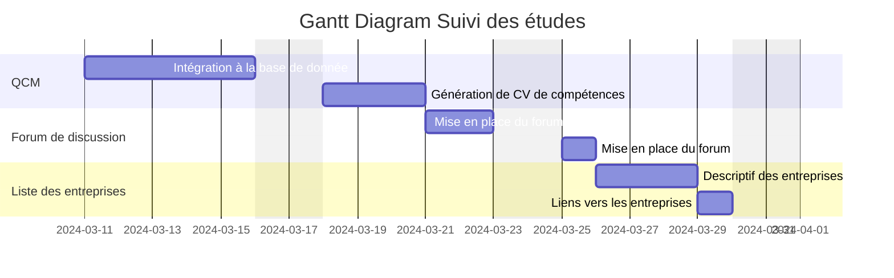

# Diagramme de Gantt
Le diagramme de Gantt, largement utilisé en gestion de projet, est un outil efficace pour visualiser l'avancement des différentes activités d'un projet. La colonne de gauche énumère les tâches, tandis que la ligne d'en-tête représente les unités de temps (jours, semaines, mois). Chaque tâche est représentée par une barre horizontale indiquant la date de début, la durée, et la date de fin. Le diagramme offre une vue rapide de :

Les tâches à réaliser
Les dates de début et de fin de chaque tâche
La durée estimée de chaque tâche
Le chevauchement éventuel des tâches et sa durée
Les dates de début et de fin du projet dans son ensemble
En résumé, le diagramme de Gantt liste toutes les tâches nécessaires pour achever le projet et indique quand elles doivent être réalisées (le planning).

## Diagramme de Gantt : Suivi des études

