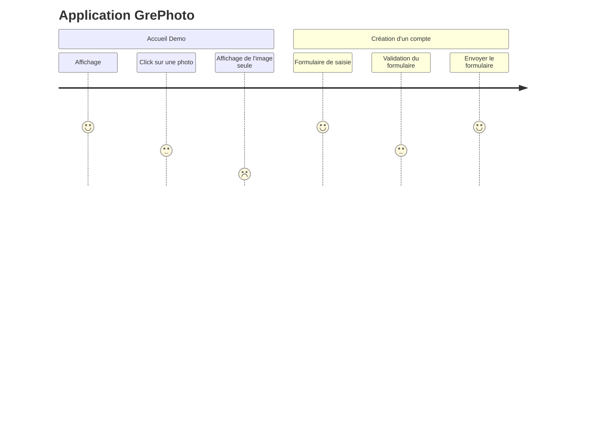
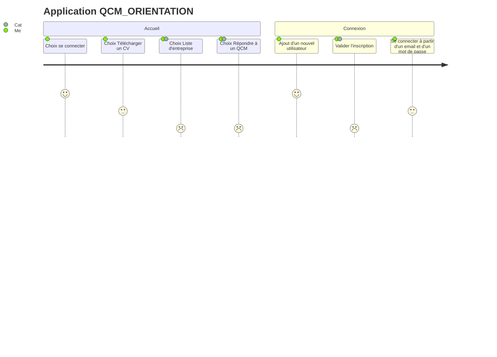
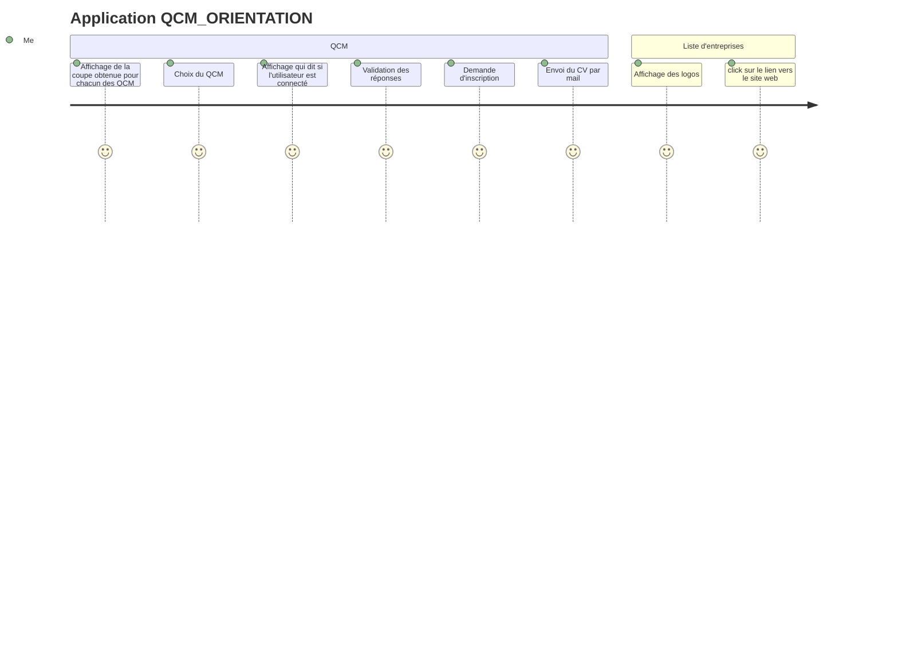
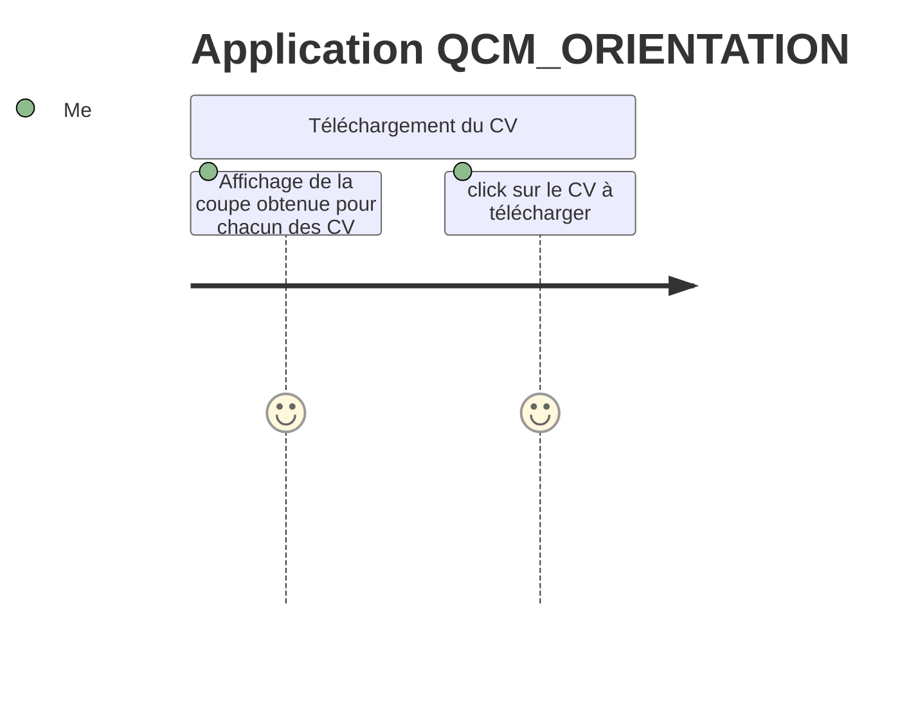

# User journey

## Définition

Un diagramme de user journey decrie à un haut niveau de détail les étapes que les différents utilisateurs prennent pour compléter une tâche spécifique dans un système, une application ou un site web. Cette technique montre le workflow actuel et révèle les zones d'amélioration à aller chercher.

## Objectif

Avoir une vision rapide des étapes réalisées par les utilisateurs et donc découvrir des zones non utilisées ou des étapes inutiles.
Avoir un aperçu rapide du ressenti des utilisateurs.

## En complément

Un user journey pourra être complété par une description écrites des étapes, des captures d'écran, des vidéos, des interviews utilisateurs, des données d'analyse, des données de performance, des données de satisfaction, etc.

## Projet QCM_Orientation

